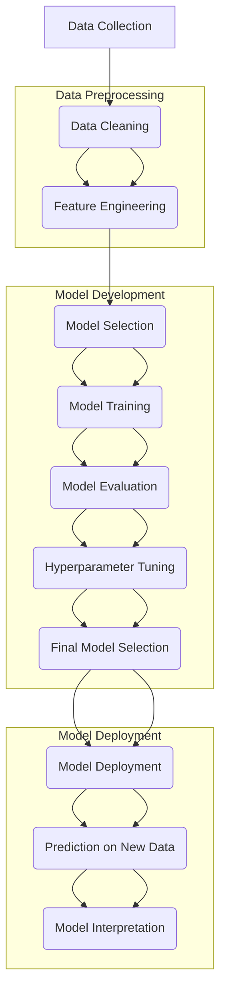

<h1> Desigining Intelligence with NanoGrad </h1>
<h3> An auto gradient and backpropagation library</h3>

 By Zoya Jamadar 

<h2> Description </h2>

Nanograd is a powerful reverse mode auto-differentiation module built in Python. It uses a dynamically generated directed acyclic graph (DAG) along with a small neural network library to provide a PyTorch-like API.

One unique feature of Micrograd is that its DAG only operates over scalar values. This means that each neuron is broken down into its individual tiny adds and multiplies. Despite this limitation, Micrograd is still able to build entire deep neural networks for binary classification.

<h2> AIM </h2>

The aim of Nanograd is to provide a lightweight and easy-to-use auto-differentiation module for Python that allows for the efficient training of deep neural networks.

<h2> OUTPUT </h2>

