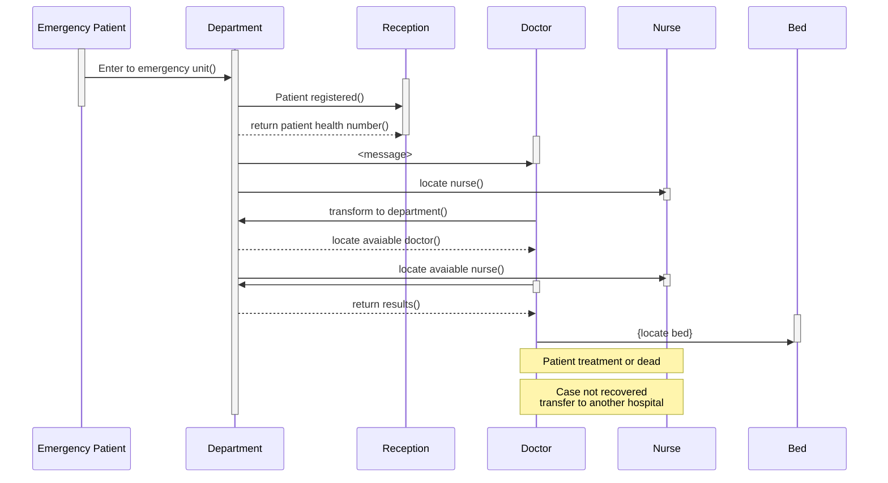

```mermaid
   sequenceDiagram
    activate Emergency Patient
    activate Department
    Emergency Patient->>Department: Enter to emergency unit()
    activate Reception
    Department ->> Reception : Patient registered()
    deactivate Emergency Patient
    Department -->> Reception  : return patient health number()
    deactivate Reception
    activate Doctor
    Department ->> Doctor : <message>
    deactivate Doctor
    
    Department ->> Nurse :locate nurse()
    activate Nurse
    deactivate Nurse
    Doctor ->> Department : transform to department()
    Department -->> Doctor : locate avaiable doctor()
    Department ->> Nurse : locate avaiable nurse()
    activate Nurse
    deactivate Nurse
    activate Doctor
    Doctor ->> Department : 
    deactivate Doctor
    Department -->> Doctor : return results()
    activate Bed 
    Doctor ->> Bed : {locate bed}
    deactivate Bed
    Note over Doctor,Nurse : Patient treatment or dead
    Note over Doctor,Nurse : Case not recovered <br/> transfer to another hospital
    

   
    deactivate Department
```
